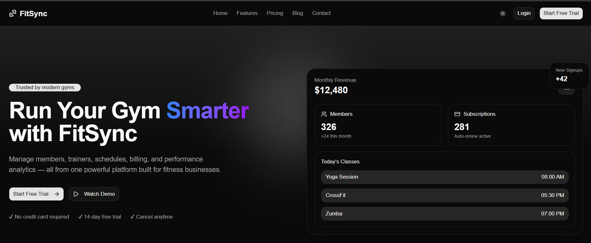
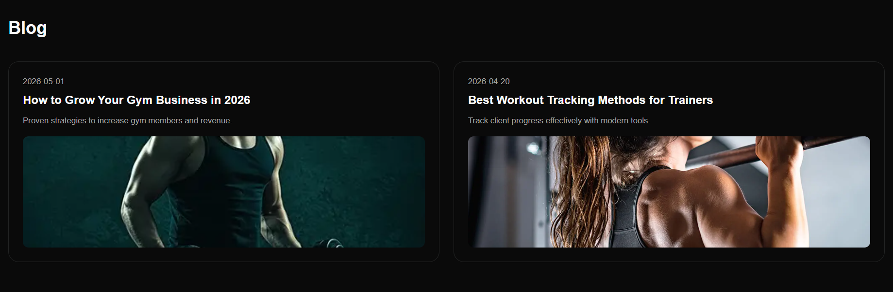
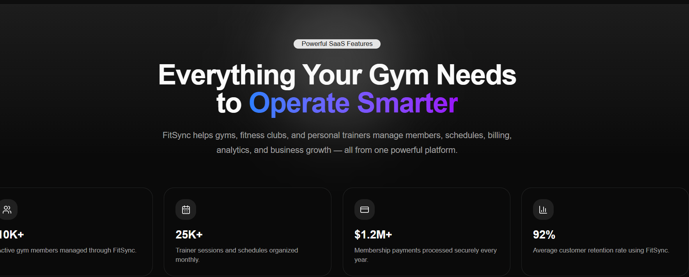

# FitSync - Gym Management Platform

A modern, all-in-one gym management system designed to help fitness businesses streamline operations, manage members, and grow revenue.

## 📋 About This Application

**FitSync** is a comprehensive SaaS platform built for fitness businesses of all sizes. It provides gym owners and managers with powerful tools to manage every aspect of their fitness business from member management to financial tracking. With an intuitive interface and real-time analytics, FitSync empowers fitness entrepreneurs to focus on what they do best—building thriving fitness communities.







### Key Statistics

- **500+** gyms worldwide trust FitSync
- **24/7** access from any device
- **14-day** free trial (no credit card required)
- Built for modern fitness businesses

---

## ✨ Key Features

### 👥 Member Management

- Store comprehensive member profiles with contact information
- Track membership plans, renewal dates, and subscription status
- Monitor attendance history and member progress
- Manage member communications and notifications

### 📅 Trainer Scheduling

- Intuitive calendar system for trainer availability
- Easy session booking and management
- Trainer availability tracking and conflict prevention
- Client-trainer assignment and history

### 💳 Subscription Billing

- Automated monthly membership billing
- Payment tracking and invoice generation
- Renewal reminders and dunning management
- Support for multiple payment methods
- Revenue monitoring and reporting

### 🏋️ Workout Plans & Progress Tracking

- Create custom workout programs tailored to client goals
- Track exercise performance and progress over time
- Monitor client improvements with visual graphs
- Best practices for consistent results and accountability

### 📊 Reports & Analytics

- Real-time revenue dashboards
- Member growth and retention metrics
- Attendance analytics and trends
- Financial performance reports
- Data-driven insights for business decisions

### 📱 Mobile Access

- Fully responsive design for all devices
- Members access their schedules and plans on-the-go
- Trainers manage sessions from anywhere
- Push notifications for updates and reminders

---

## 🛠️ Tech Stack

### Frontend

- **Framework**: [Next.js 16.2.4](https://nextjs.org/) - React-based full-stack framework
- **UI Library**: [React 19.2.4](https://react.dev/)
- **Styling**:
  - [Tailwind CSS 4](https://tailwindcss.com/) - Utility-first CSS framework
  - [Shadcn/ui](https://ui.shadcn.com/) - High-quality UI components
  - [Radix UI 1.4.3](https://www.radix-ui.com/) - Unstyled, accessible component library
- **Animation**: [Framer Motion 12.38.0](https://www.framer.com/motion/) - Animation library
- **Icons**: [Lucide React 1.14.0](https://lucide.dev/) - Icon library

### Content & MDX

- [@next/mdx](https://nextjs.org/docs/pages/building-your-application/configuring/mdx) - Support for Markdown with JSX
- [next-mdx-remote 6.0.0](https://github.com/hashicorp/next-mdx-remote) - Render MDX content
- [gray-matter 4.0.3](https://github.com/jonschlinkert/gray-matter) - Parse YAML frontmatter
- [remark](https://remark.js.org/) & [rehype](https://github.com/rehypejs/rehype) - Markdown processing

### Utilities

- **Theme Support**: [next-themes 0.4.6](https://github.com/pacocoursey/next-themes) - Dark/light mode switching
- **CSS Utilities**: [clsx 2.1.1](https://github.com/lukeed/clsx), [tailwind-merge 3.5.0](https://github.com/dcastil/tailwind-merge)
- **Reading Time**: [reading-time 1.5.0](https://github.com/nuhil/reading-time) - Estimate article reading duration

---

## 📦 Project Structure

```
fitsync/
├── app/                          # Next.js App Router
│   ├── api/                      # API routes
│   │   └── contact/              # Contact form endpoint
│   ├── blog/                     # Blog pages
│   │   └── [slug]/               # Dynamic blog post pages
│   ├── features/                 # Features showcase page
│   ├── pricing/                  # Pricing page
│   ├── contact/                  # Contact page
│   ├── layout.tsx                # Root layout
│   ├── page.tsx                  # Home page
│   └── globals.css               # Global styles
├── components/                   # Reusable React components
│   ├── home/                     # Homepage sections
│   │   ├── hero-section.tsx      # Hero banner
│   │   ├── features-hero.tsx     # Features section
│   │   ├── dashboard-showcase.tsx # Dashboard preview
│   │   ├── pricing-preview.tsx   # Pricing cards
│   │   ├── testimonials-faq.tsx  # Testimonials & FAQ
│   │   └── cta-footer.tsx        # Call-to-action footer
│   ├── layout/                   # Layout components
│   │   ├── navbar.tsx            # Navigation bar
│   │   └── theme-provider.tsx    # Theme context provider
│   ├── shared/                   # Shared components
│   └── ui/                       # Base UI components (shadcn/ui)
│       ├── button.tsx, card.tsx, dialog.tsx, etc.
├── content/                      # Static content
│   └── blog/                     # Blog posts in MDX format
├── data/                         # Data files
│   └── blogPosts.ts              # Blog metadata
├── hooks/                        # Custom React hooks
├── lib/                          # Utility functions
│   ├── blog.ts                   # Blog utilities
│   ├── toc.ts                    # Table of contents generation
│   └── utils.ts                  # General utilities
├── public/                       # Static assets
│   └── blog/                     # Blog images
├── types/                        # TypeScript type definitions
│   └── blog.ts                   # Blog-related types
├── package.json                  # Dependencies
├── next.config.ts                # Next.js configuration
├── tailwind.config.ts            # Tailwind CSS configuration
├── tsconfig.json                 # TypeScript configuration
└── README.md                     # This file
```

---

## 🚀 Getting Started

### Prerequisites

- **Node.js** 18.0 or higher
- **npm** or **yarn** package manager

### Installation

1. **Clone the repository**

   ```bash
   git clone <repository-url>
   cd fitsync
   ```

2. **Install dependencies**
   ```bash
   npm install
   # or
   yarn install
   ```

### Development

**Start the development server:**

```bash
npm run dev
# or
yarn dev
```

Open [http://localhost:3000](http://localhost:3000) in your browser to see the application.

### Production Build

**Build for production:**

```bash
npm run build
```

**Start production server:**

```bash
npm run start
```

### Linting

**Run ESLint to check code quality:**

```bash
npm run lint
```

---

## 📄 Available Pages

- **Home** (`/`) - Landing page with hero section and features overview
- **Features** (`/features`) - Detailed feature showcase and capabilities
- **Pricing** (`/pricing`) - Subscription plans and pricing information
- **Blog** (`/blog`) - Articles and resources for gym owners and trainers
- **Contact** (`/contact`) - Contact form for inquiries

---

## 🎨 Design Features

- **Modern UI**: Clean, professional design built with Shadcn/ui components
- **Responsive Design**: Fully responsive layout that works on all devices
- **Smooth Animations**: Engaging transitions and animations with Framer Motion
- **Dark Mode Support**: Built-in light/dark theme switching with next-themes
- **Accessibility**: Radix UI ensures WCAG accessibility standards
- **SEO Optimized**: Metadata, Open Graph, and structured data support

---

## 📝 Blog System

- Content written in **MDX format** for rich content with React components
- **Automatic metadata extraction** using gray-matter frontmatter
- **Reading time estimation** for each article
- **Code syntax highlighting** with rehype-highlight
- **Heading links** with auto-generated anchors
- **Table of contents generation** for navigation

---

## 🔒 Environment Variables

Create a `.env.local` file in the root directory with required environment variables:

```bash
# Example environment variables
NEXT_PUBLIC_API_URL=http://localhost:3000
```

---

## 📚 Learn More

- [Next.js Documentation](https://nextjs.org/docs)
- [React Documentation](https://react.dev)
- [Tailwind CSS Documentation](https://tailwindcss.com/docs)
- [Shadcn/ui Components](https://ui.shadcn.com)

---

## 📞 Support

For support and inquiries:

- Visit our [Contact Page](/contact)
- Email: support@fitsync.com
- Documentation: Check our [Blog](/blog) for helpful articles

---

## 📄 License

This project is licensed under the MIT License - see the LICENSE file for details.

---

## 🙏 Acknowledgments

Built with ❤️ for the fitness industry. Trusted by 500+ gyms worldwide.
